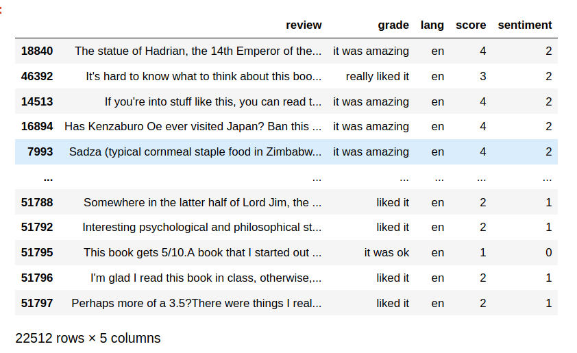

# Goodreads reviews custom database

Custom reviews-database created from scrapping goodreads.com.

I used **Selenium** to automate the scrapping of the latest 60 reviews posted in the website of more than 1000 titles. Take a look at [the code](https://github.com/DavidCarricondo/Custom-database-goodreads-reviews/blob/master/src/scrap_dataset.py)!!

## **The results**
The data comes in two flavors, the **raw result** and the **cleaned version**. 

### Raw results:
The **raw result** is a [**json** file](https://github.com/DavidCarricondo/Custom-database-goodreads-reviews/blob/master/DATA/goodread_reviews_dataset.json) with 51797 reviews with the following format:

<pre><code>
{"0": {"review": "...", 
        "grade": "it was amazing"}, 
"1": {"review": "I can see Never Let Me Go being great for book clubs ...", 
    "grade":"it was ok"},
...
}
</code></pre>

Note: Grades reflect the website grading. This is:
+   'did not like it': 1 star
+   'it was ok': 2 stars
+   'liked it': 3 stars
+   'really liked it': 4 stars
+   'it was amazing': 5 stars

### Clean version:

The **clean version** comes as a [**csv** file](https://github.com/DavidCarricondo/Custom-database-goodreads-reviews/blob/master/DATA/goodreads_reviews_clean.csv) containing 22512 reviews.

This is the result of a preprocess of the raw data carried out in [this jupyter notebook]('Data_cleaning.ipynb'). The process consisted on the following main steps:
+   Remove empty reviews (1832)
+   Remove reviews that were not in english language (1767)
+   Transform string grade to numerical score
+   Transform numerical score to sentiment (neg, neu, pos)
+   Balance the data according to the sentiment score.

After this process, the data has the following form:

## Usage

This dataset was originally conceived for the prediction of the sentiment polarity of the book reviews.

The dataset has been used in the training of the Recurrent Neural Network used in [this dashboard](https://github.com/DavidCarricondo/selenium-NLP). Morover, the live scrapping in that same dashboard is a modification of the code used to generate this dataset.